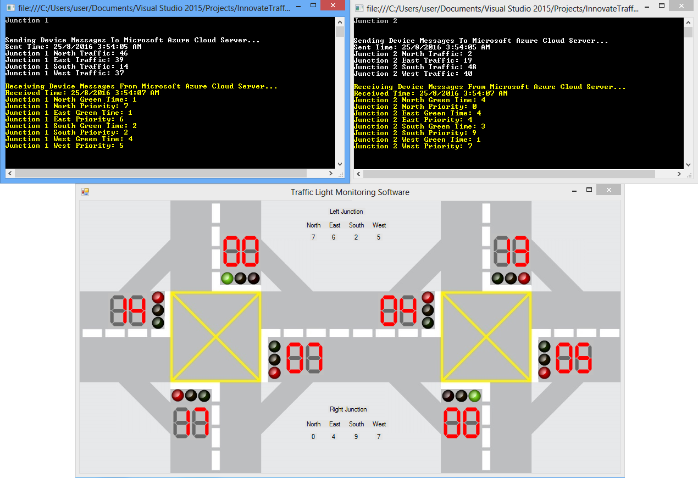
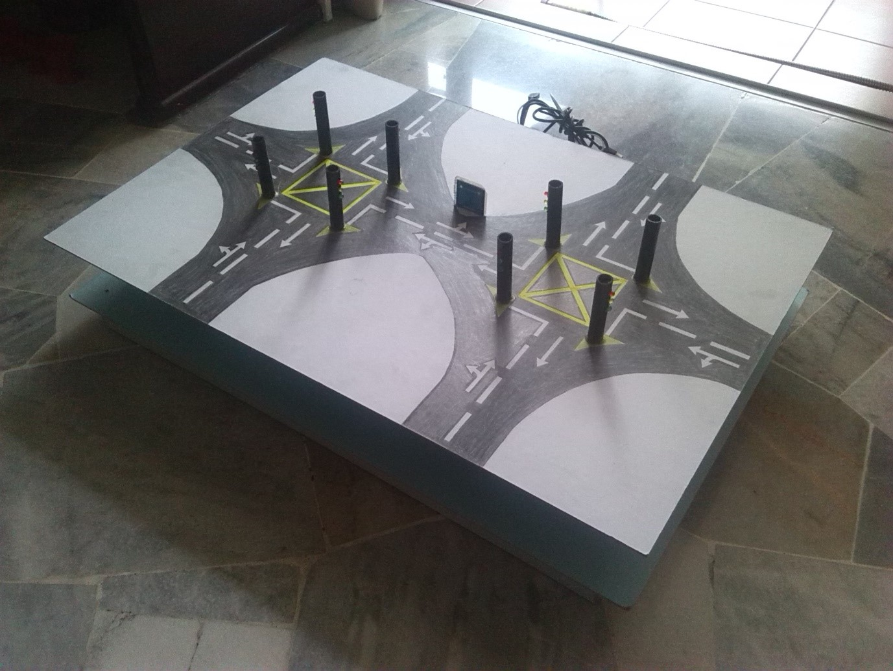

# Traffic Light System

## Getting Started

This is an IoT based system designed for project name "[Development of IoT device for traffic management system](https://ieeexplore.ieee.org/document/7810059)", which aim to mitigate city traffic congestion with Intel Edison and Microsoft Azure IoT cloud server.

## Deployment

A prototype is built for demonstration purpose, as per screenshot below: 

  
  

## Built With

[GCC Complier](https://gcc.gnu.org/) 
[Microsoft Visual Studio 2015](https://visualstudio.microsoft.com/)

## Versioning

[Semantic Versioning (SemVer) 2.0.0](http://semver.org/)

## Authors

**Jerry Chong** - [jerrychong25](https://github.com/jerrychong25) 

## License

This project is licensed under the MIT License - see the [LICENSE.md](LICENSE.md) file for details
